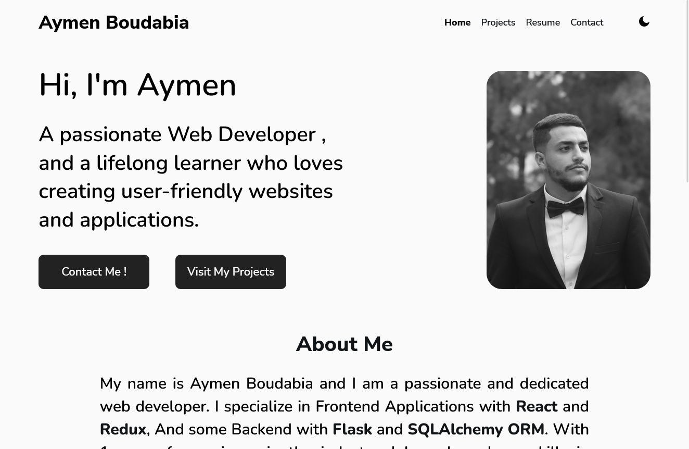
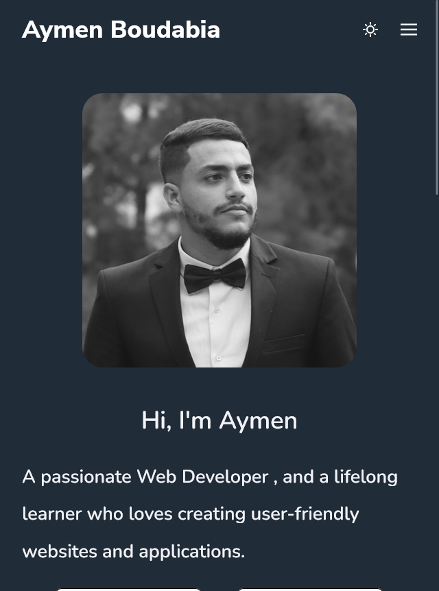
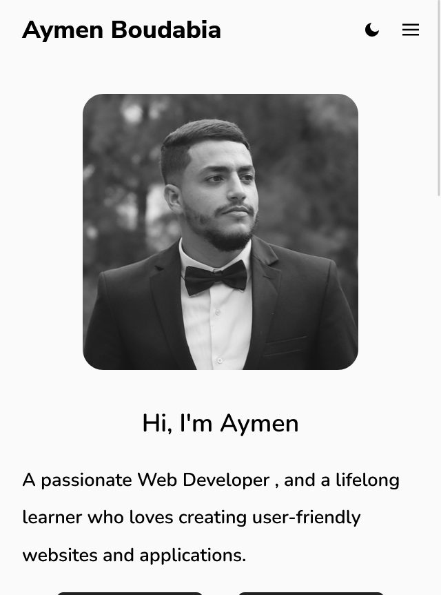
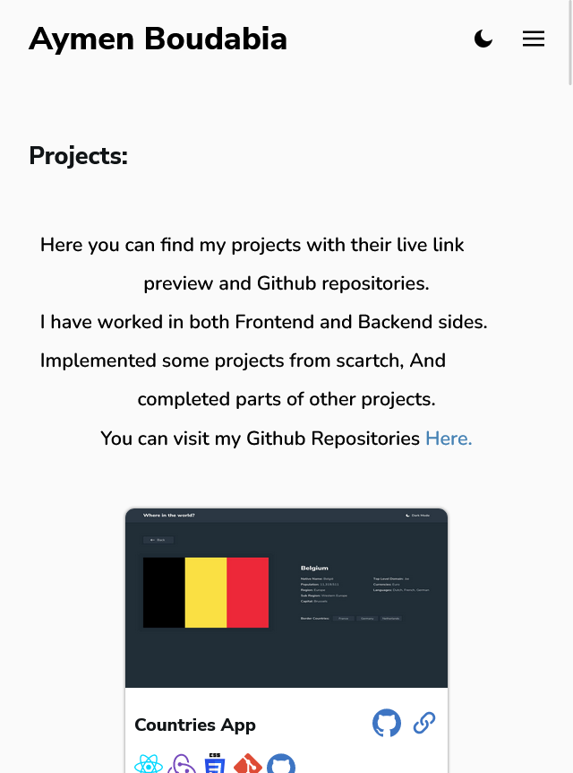
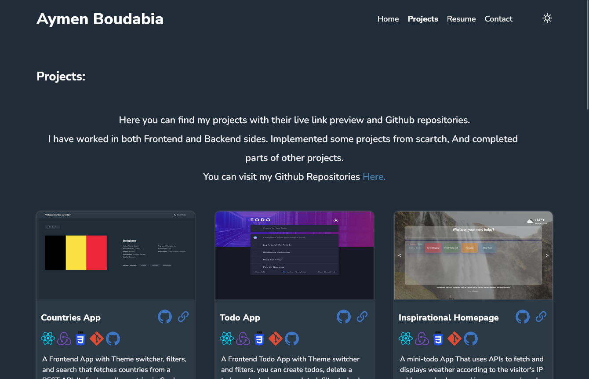
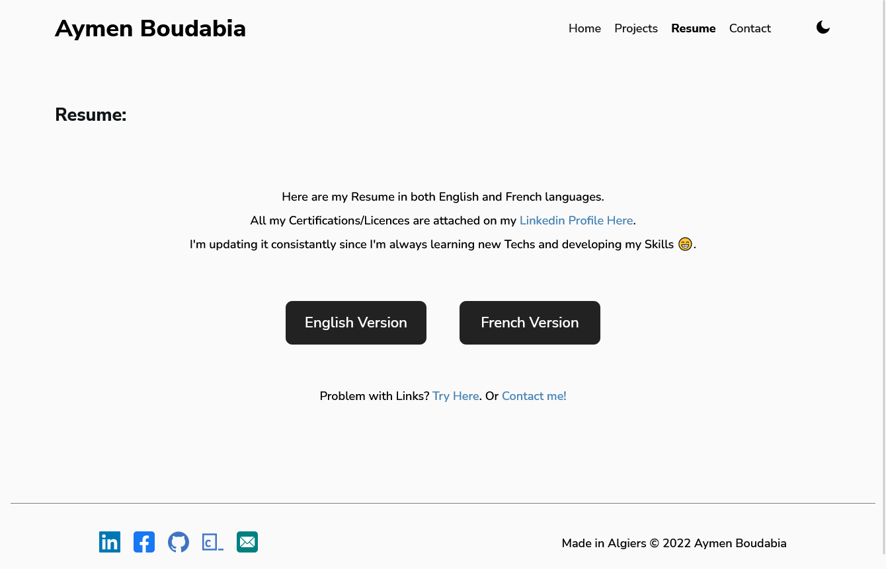

# Personal Portfolio - Aymen Boudabia

This is my first implementation of my personal portfolio website.

## Table of contents

- [Overview](#overview)
  - [Description](#description)
  - [Links](#links)
  - [Screenhots](#screenshots)
- [My process](#my-process)
  - [Built with](#built-with)
  - [Continued development](#continued-development)
- [Author](#author)

## Overview

### Description

 This portfolio website is multipaged, Routes are: 
- Home : contains my photo, about me, and my skills.
- Projects: contains my finished projects represented as cards, with their corresponding Github Repository, live link, and description.
- Resume: contains my Resume links in both French and English.
- Contact: A contact page with contact form.

### Links

- Live Site URL: [Live site URL here](https://aymenboudabia.netlify.app)

### Screenshots

## My process

### Built with

- Semantic HTML5 markup
- CSS3
- Flexbox
- CSS Grid
- Media Queries
- [React](https://reactjs.org/) - JS library
- React Router
- Redux
- EmailJs

### Continued development

- Update Projects page with new projects.

## Author

- Github Repo - [Aymen Boudabia](https://www.github.com/aymenfisher)
- Linkedin - [Aymen Boudabia](https://www.linkedin.com/in/aymen-boudabia)

